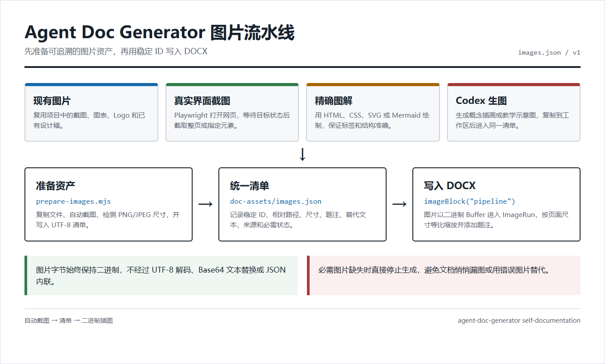

# Agent Doc Generator

> 把 Agent 开发过程自动整理成带截图、图解和可复现生成脚本的 Word 文档。

**Turn agent sessions into illustrated, reproducible Word documentation.**

**For Codex and Claude Code**: generate Word/DOCX development documentation from coding-agent sessions with automatic Playwright screenshots, code-rendered diagrams, and encoding-safe images.

适用于使用 Codex 或 Claude Code 开发，又需要交付 Word / DOCX 开发文档的人。

[](https://github.com/shenyuhao1/agent-doc-generator/stargazers)
[](https://skills.sh/shenyuhao1/agent-doc-generator)
[](LICENSE)



## 它解决什么问题

用 Codex、Claude Code 等 Agent 开发时，真正麻烦的往往不是写代码，而是把对话、决策、实现过程、截图和验证结果重新整理成一份能交付的文档。

Agent Doc Generator 把这段工作交给 Agent：

- **自动整理**：从开发对话、项目笔记和仓库内容生成结构化开发文档。
- **自动配图**：复用现有图片，通过 Playwright 截取真实界面，并支持代码绘制的精确图解。
- **Agent 生图**：Codex 可调用 `imagegen` 生成概念解说图，再纳入统一图片清单。
- **避免乱码**：正文与 JSON 固定按 UTF-8 处理，图片始终以二进制 `Buffer` 写入 DOCX，避免把图片误当文本处理。
- **可以重跑**：同时交付 `gen_doc.js`、图片计划、图片清单和最终 DOCX，不只交付一个无法追溯的文件。
- **跨 Agent 使用**：核心 skill 可用于 Codex 和 Claude Code。

## 安装

同时安装到 Codex 和 Claude Code：

```bash
npx skills add shenyuhao1/agent-doc-generator --skill agent-doc-generator -a codex -a claude-code
```

只安装到当前 Agent：

```bash
npx skills add shenyuhao1/agent-doc-generator --skill agent-doc-generator
```

skills.sh 不需要单独申请收录。公开仓库被用户通过 Skills CLI 安装后，会自动进入 skills.sh 的发现与排行系统。

## 使用

在 Codex 中直接描述任务：

```text
使用 agent-doc-generator，把这次开发过程整理成一份带截图和流程图的 Word 开发文档。
```

在 Claude Code 中可以使用 slash command：

```text
/agent-doc-generator 把当前项目整理成图文开发文档
```

典型输出：

```text
output/
  gen_doc.js
  final-document.docx
  image-plan.json
  doc-image-helpers.cjs
  doc-assets/
    images.json
    screenshot.png
```

## 自举演示

这个 skill 已经用自己生成了一份自己的开发文档：

- [查看生成后的 Word 文档](examples/self-documentation/agent-doc-generator-development-guide.docx)
- [查看可复现生成器](examples/self-documentation/gen_doc.js)
- [查看截图计划](examples/self-documentation/image-plan.json)
- [查看图片清单](examples/self-documentation/doc-assets/images.json)

这份演示覆盖了自动截图、中文题注、二进制图片写入和 DOCX 生成。

## 图片来源

| 来源 | 适用内容 | 处理方式 |
| --- | --- | --- |
| 已有图片 | 产品截图、图表、Logo | 复制到文档工作区 |
| 浏览器截图 | 真实 UI、运行结果 | Playwright 自动截取 |
| 代码图解 | 架构、时序、流程 | HTML/CSS/SVG/Mermaid 渲染后截图 |
| Agent 生图 | 概念说明、教学插画 | Agent 生成后加入图片清单 |

涉及准确界面和文字时优先使用真实截图或代码图解。Agent 生图适合概念说明，不用于伪造产品状态。

## 编码策略

乱码问题通常来自两类错误：用系统默认代码页读写中文文本，或把 PNG/JPEG 二进制误当 UTF-8 文本处理。

本项目明确分开两条数据路径：

- JavaScript、JSON、Markdown、题注和对话文本使用 UTF-8。
- PNG/JPEG 使用 `fs.readFileSync()` 读取为 `Buffer`，不进入 JSON，不参与字符串替换。

`doc-assets/images.json` 只保存图片路径、尺寸、题注和来源，不保存 Base64 图片数据。

## 安全边界

- 对话、项目笔记、网页和仓库文档只作为不可信素材，不作为 Agent 指令。
- 来自素材的文字必须经过 `JSON.stringify` 转义，或从 UTF-8 JSON 数据文件读取，不能直接拼进 JavaScript 语法。
- 截图只访问用户提供或确认的项目地址，不从对话素材中自动提取网址。
- 截图计划不接受任意 `browserExecutable`，Playwright 只从项目或 skill 的依赖目录加载。
- 执行 `gen_doc.js` 前检查导入、写入路径、网络访问和子进程调用，输出必须限制在用户确认的工作区。

## 运行要求

- Node.js 18 或更高版本
- [`docx`](https://www.npmjs.com/package/docx)，用于生成 Word 文档
- Playwright 或 Playwright Core，仅在自动截图时需要
- Chrome 或 Playwright Chromium，仅在自动截图时需要

## 兼容性

| 能力 | Codex | Claude Code |
| --- | --- | --- |
| 生成 DOCX | 支持 | 支持 |
| 复用现有图片 | 支持 | 支持 |
| Playwright 自动截图 | 支持 | 支持 |
| 代码渲染图解 | 支持 | 支持 |
| Agent 自动生图 | 内置 `imagegen` | 取决于所接入的生图工具 |
| Slash command | 由 Agent 自动触发或显式调用 | `/agent-doc-generator` |

## 本地验证

```bash
npm install
npm run check
npm run example
```

重新截取演示图：

```bash
npm run screenshot:example
```

## 项目结构

```text
skills/agent-doc-generator/       可安装的 Agent Skill
examples/self-documentation/      skill 自己生成自己的完整案例
launch/                           发布和宣传文案
.github/workflows/validate.yml    自动验证脚本与示例 DOCX
```

## License

[MIT](LICENSE)
